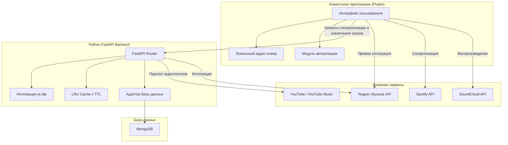

# Quark

Quark — это легковесный кроссплатформенный аудиоплеер. Клиентская часть разработана на Flutter, а вспомогательная серверная часть — на Python (FastAPI) с использованием СУБД MongoDB.

## Архитектура и схема работы

Приложение разделено на клиентскую часть (интерфейс и локальный плеер) и бэкенд, который обеспечивает интеграцию с веб-сервисами, кэширование запросов и синхронизацию данных.

## Функциональные возможности

### Локальное воспроизведение
- Поддержка большинства аудиоформатов.
- Регулировка скорости воспроизведения (ускорение и замедление аудиозаписей).
- Сканирование локальных директорий с поддержкой рекурсивного поиска файлов.

### Интеграция с музыкальными сервисами
- Яндекс Музыка:
  - Полная поддержка библиотеки (лайки, плейлисты, рекомендации).
  - Выбор качества стриминга (Lossless, 256 kbps, 64 kbps).
  - Кеширование треков и метаданных.
  - Экспорт треков и плейлистов в формате FLAC с автоматической разметкой метаданных (ID3-теги, обложки).
- Spotify: импорт и синхронизация пользовательских плейлистов.
- YouTube / YouTube Music: поиск треков, извлечение аудиопотоков и воспроизведение плейлистов.
- SoundCloud: интеграция для стриминга аудио.

### Возможности FastAPI бэкенда
- Проксирование запросов к YouTube и YouTube Music с использованием yt-dlp для обхода блокировок.
- Многопоточный потокобезопасный in-memory LRU-кэш с поддержкой времени жизни (TTL) для снижения задержек и нагрузки на внешние сервисы.
- Обработка авторизации, cookie-файлов и синхронизация учетных записей.
- Работа с MongoDB для индексации и хранения истории воспроизведения, плейлистов и настроек пользователя.

### Интерфейс и кастомизация
- Динамическая адаптация цветовой гаммы интерфейса под обложку трека или тему системы.
- Эффект размытия (glassmorphism) заднего фона и окон.
- Полная локализация интерфейса на 10 языков (русский, английский, испанский, французский, немецкий, португальский, китайский, японский, корейский, турецкий).

## Системные требования и зависимости

### Windows
- Требуется установленный Microsoft Visual C++ Runtime (vcredist.exe).
- Для корректной работы WebView-авторизации на версиях Windows ниже 10 1809 требуется установленный Microsoft Edge WebView2 Runtime.
- Рекомендуется установка MSVC для предотвращения аварийного завершения работы приложения при авторизации.

### Linux
- Требуется наличие библиотек libgtk-4-1+ или libqt6gui6 (обычно предустановлены в большинстве дистрибутивов).

## Скриншоты

  
  

## Разработчики
- z3nsh0w (https://github.com/z3nsh0w)
- aror (https://github.com/Aror1)

Лицензия проекта: MIT. Подробности находятся в файле LICENSE.
